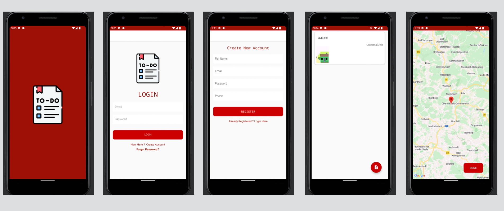

# Android-image-browser
Todo list application to run on android os. Has the feature to capture and add pictures to each list entry using the device camera. Gets the user's gps location and adds the city name with each entry. Also has google maps to choose location to add to the entry. Stores data locally using SQLite. Also contains user authentication using Firebase.

